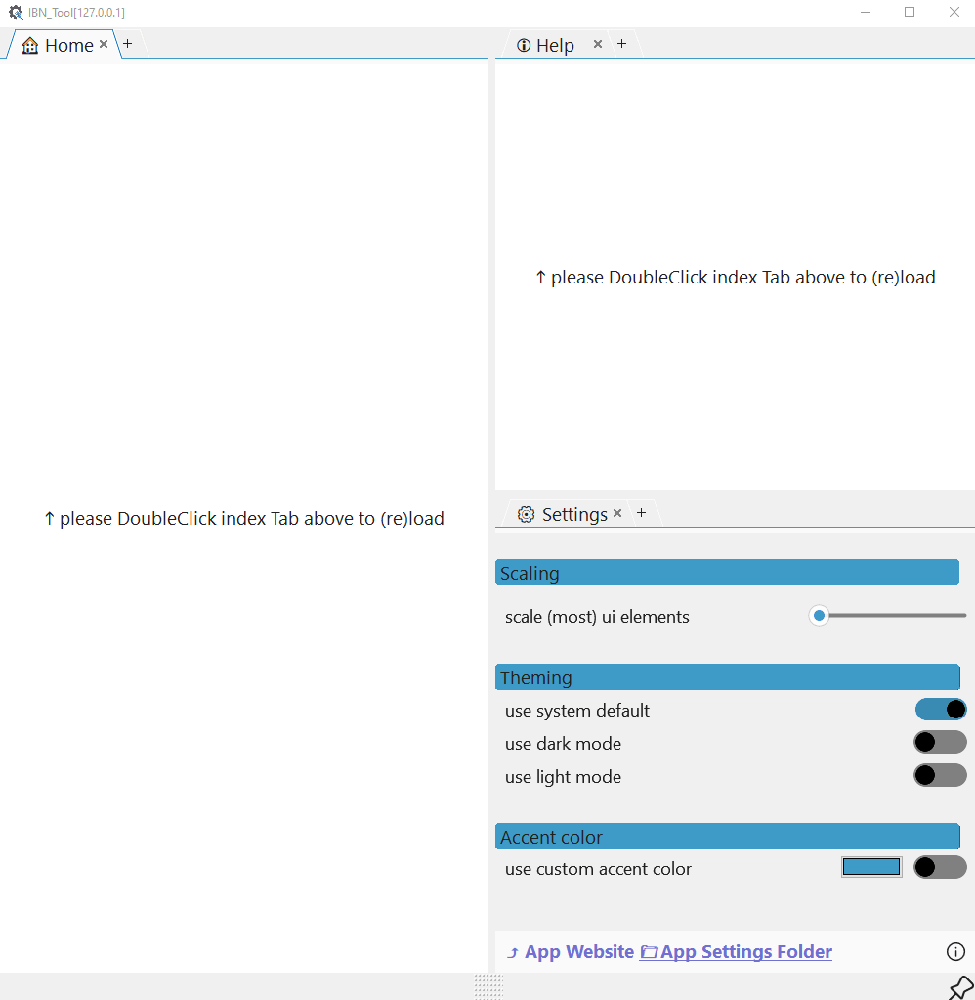

# IBN_Tool Infos

**Version: 0.1.1.107**

***This prog is intended for commissioning Fanuc robots***

And that's why it's called **IBN-Tool** (**I**n**B**etrieb**N**ahme is the german word for commissioning)

## Alpha Version

- Connect to various robot screens
- predefined and custom screens are easily accessable
   - 
   - **At app startup you have to double click the corresponding tab to (re)load!**

- rearrange tabs
- add tabs
   - 

- change UI/UX
   - scale elements
   - change colors
   - 

---
---

- This is an early, non-productive version of the software.
It's meant to be a POC (proof of concept) demonstrator.
- Microsoft Edge WebView2 must be installed (WIN10 only)
   - https://developer.microsoft.com/de-de/microsoft-edge/webview2/?form=MA13LH
- Some components will change massively over time.
- For now prog will **only** connect to first **Roboguide** robot
- There is no installer
- Prog needs to be placed within a directory with write access to store the browsers cache files.
- Start only one instance at a time (due to shared cache files)
- ~~closing of tabs does not work~~
- ~~no custom tabs (will be added as soon as possible)~~

*The core components of the software are quite stable.
DragAndDrop of tabs, the implementation of the browser engines and layout changes by the user work well.*

However, many components and functions need to be tested and expanded.

### Features

The app uses/hosts two browser engines:
- webview2 (Edge/Chromium)
   - You have a the power of a modern browser to be used with iRProgrammer and so on.
- MSHTML (Internet Explorer)
   - view/use old ActiveX webpages like CGTP, ECHO and old iRVision !

Create backups eaysily via FTP

User can change main view to trible, double and other window layouts. On top of that **IBN_Tool** supports tabs to give user the most flexible way to work with a bunch of webpages.

All within one app window! And that's the key:

**You won't get annoyed with lots of overlapping windows**

You are able to rearrange tabs like in any modern ide or browser.

   - 

- **The ieX FTP and file browser component will be replaced with native (async) ones**

   - 
   - We will support different IDEs/ editors
- the software should support you in your workflow, not dictate what you have to do

### Bugs
There is a bug when dragging an edge tab to a different tab group

- DoubleClick the tab header to solve
- 

### Software update
Inside App-Settings click "APP Website"

this will open your default browser and navigates to:

- [https://backdate.github.io/](https://backdate.github.io/)
 - browse to website and compare version 

### Changelog

---
**The next major update is scheduled for end of 2025**

 - see roadmap
---

#### Minor changes
-  first alpha release / 10.11.2025
   - refactor : AddTab dialog
   - bugfixing
   - improved tabs

---

- seventh  pre alpha release / 08.11.2025
   - add: save and restore tabs
   - bugfixing
   - disable FTP button
   - improved splitter

- sixth pre alpha release / 29.10.25
  - bug fixes
      - reload ieX components
      - removed ovelapping panel

  - features 
      - splitter color and with
      - add single view window

- fifth pre alpha release / 25.03.25
   - bug fix ( new tab)

- fourth pre alpha release / 24.03.25
   - more predefined tabs
   - switch layout menu bar
   - auto save of last "config"

- third pre alpha release / 19.03.25
   - add:user defined TABs
      - max 3x ieX
      - max 3x edge
   - update startup sequence
   - add:change base IP address

- second pre alpha release / 14.03.25
   - user defined TAB
   - close und open tabs
   - performance optimization
- initial pre alpha release / 06.03.25

### Roadmap

**The next major update is scheduled for end of 2025**

**Most but not all of following features will be available in V1.0 (03/2026):**

-  Roboguide V10 "integration"
   - with release of RG10.4(oct/2025) , we have defined our (desired) features:
      - No direct integration
      - Start via Web IO and Web SOP or the robot's homepage using RG-Controller-RightClick-Meu
      - show roboguide help

      - start from Roboguide (as chrome.exe)
      - copy and rename app to chrome.exe
      - add the new "chrome path to roboguide
         - RG V9 :Tools-Options-System
         - RG V10 :Options-System

- (S)FTP/communication panel
   - sftp/ssl lib(s) need attention
- a lot of internal refactor
- new settings tab (add connections)
- installer testing
- single view mode
- buttons to navigate back/forward
   - --> use context menu or [ALT] - CURSOR-keys
- ~~parse commandline args, so that roboguide may start the app~~
- add native LS/Prog Viewer with customizeable highlighter
   - 
   - 
- add native LS/Prog Viewer with customizeable highlighter
   - 
   - 

- add native FTP/SFTP support
   - 
- save custom webpages
- quick dev-component to view custom IO's,Regs, vars inside ONE panel
- ping tool for network discovery
   - e.g. view/embed other webpages
      - configure IO devices or grippers
   - Python scripts for easy conversion
      - e.g. copy from Excel --> python-convert-clipboard --> paste to Fanuc-LS-Prog
- set breakpoints and view variables
- simple Markdown component

---

Fanuc, Fanuc Roboguide are  registered trademarks

---

   (c) Backdate Software GmbH / Andreas Wissing

---